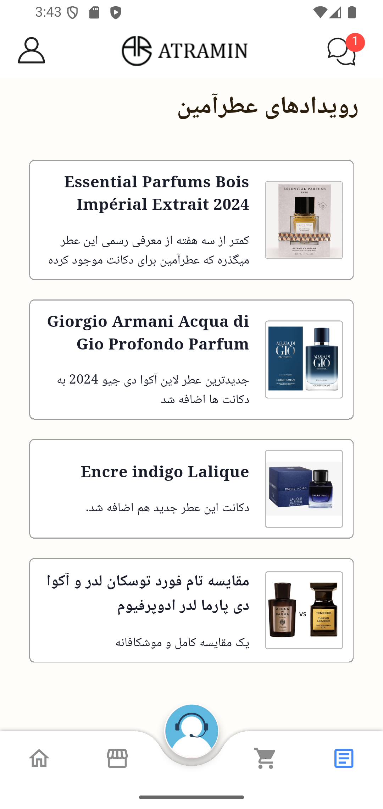
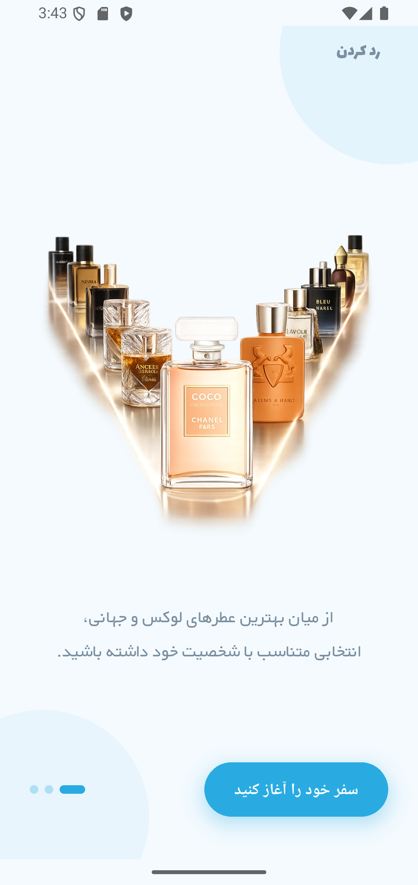
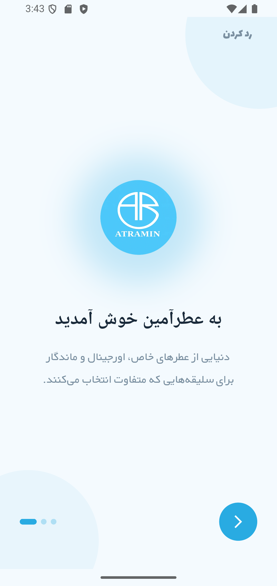
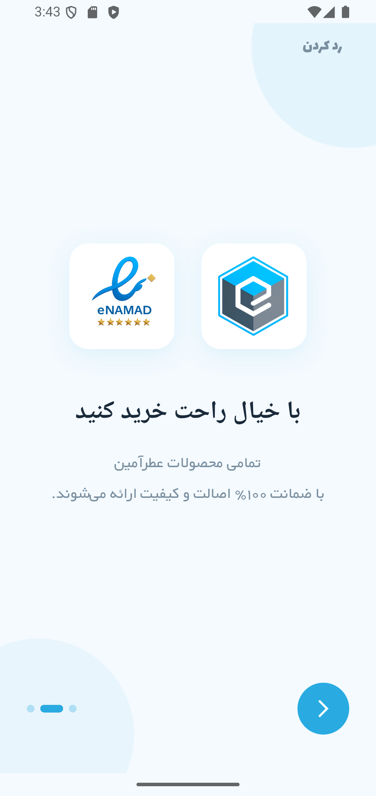
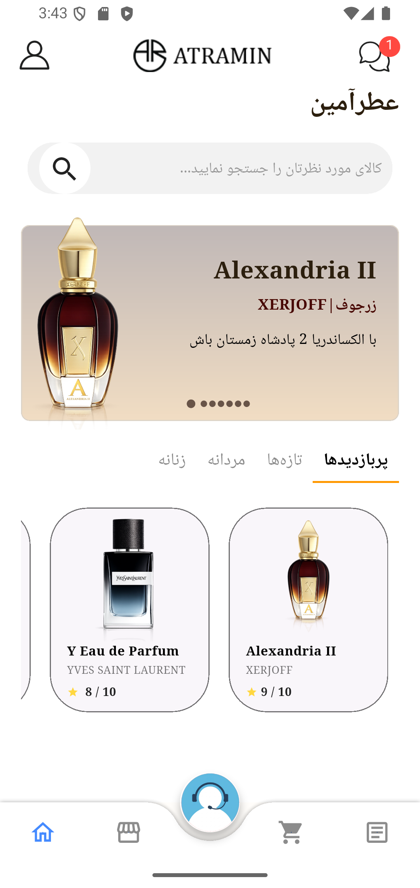

# آترامین — طراحی UI فروشگاه عطر و ادکلن (فلاتر)

[English version](README.md)

یک پروژه‌ی نمونه‌کار UI/UX که به‌عنوان یک اپلیکیشن کامل فروشگاهی برای **آترامین** طراحی و پیاده‌سازی شده؛ یک فروشگاه مفهومی عطر و ادکلن با الهام از سایت [atramin.ir]. هدف این پروژه، طراحی یک تجربه‌ی خرید شیک و کاملاً راست‌چین (RTL) برای بازار عطرهای لوکس بوده — از صفحه‌ی خوش‌آمدگویی تا مرور محصولات و صفحه‌ی کامل جزئیات محصول، همه با فلاتر.

تمرکز این پروژه روی **کیفیت UI و طراحی تعامل** است، نه اتصال به بک‌اند: داده‌های محصولات به‌صورت لوکال/mock هستند و فرآیند پرداخت واقعی وجود ندارد.

---

## صفحات اپلیکیشن

### خوش‌آمدگویی (Onboarding)
یک فرآیند سه‌مرحله‌ای انیمیشنی که برند رو معرفی می‌کنه، با نمادهای اعتماد (اینماد/اعتماد الکترونیکی) اعتمادسازی می‌کنه، و پیش‌نمایشی از کاتالوگ محصولات نشون می‌ده.

| خوش‌آمدگویی | نمادهای اعتماد | پیش‌نمایش کاتالوگ |
|---|---|---|
|  |  |  |

### صفحه اصلی
اسلایدر بنر برای محصولات ویژه، تب‌های دسته‌بندی سریع (پربازدیدترین / تازه‌ها / مردانه / زنانه)، و گرید محصولات با اسکرول.

### فروشگاه / کاتالوگ
نمای کامل کاتالوگ با جستجو، فیلتر دسته‌بندی (همه / زنانه / مردانه / دکانت)، پنل فیلتر پیشرفته، و مرتب‌سازی.

### جزئیات محصول
امتیاز عطر (از ۱۰ همراه با نمایش ستاره‌ای)، نشان گارانتی اصالت، جنسیت، خانواده بویایی، سال عرضه، و توضیحی ادبی به فارسی — طوری طراحی شده که مثل یک معرفی مجله‌ی عطر خونده بشه، نه یک آگهی معمولی فروشگاهی.

### فید اخبار و رویدادها
یک فید محتوایی داخل اپ («رویدادهای عطرآمین») که عطرهای جدید و مقایسه‌های محصولات رو نمایش می‌ده تا کاربر بین خریدها هم درگیر اپ بمونه.

---

## این پروژه چه چیزی رو نشون می‌ده

- **طراحی کاملاً RTL** — هر صفحه، انیمیشن و چیدمان از پایه برای خوانش راست‌به‌چپ فارسی طراحی شده، نه اینکه بعداً تطبیق داده شده باشه.
- **ناوبری پایین صفحه سفارشی** همراه با دکمه‌ی شناور انیمیشنی پشتیبانی/چت (`animated_bottom_navigation_bar`).
- **سیستم رنگ داینامیک و هماهنگ با برند** با استفاده از Material You (`material_color_utilities`) به‌جای پالت‌های ثابت.
- **ترنزیشن‌های سفارشی بین صفحات** (`page_transition`) برای یک جریان ناوبری روان‌تر و نیتیوتر از مسیرهای پیش‌فرض فلاتر.
- **محتوای محصول به سبک ادیتوریال** — متن توضیحات، امتیازها و جزئیات اصالت، طوری طراحی شده که برای یک محصول لوکس اعتماد و جذابیت بسازه، نه فقط قیمت رو نشون بده.
- **پوسته‌ی آماده برای انتشار** — آیکون اختصاصی اپ و تنظیمات آیکون تطبیقی (adaptive icon) با `flutter_launcher_icons`.

## تکنولوژی‌های استفاده‌شده

| دسته | ابزار |
|---|---|
| فریم‌ورک | Flutter |
| ناوبری | `page_transition`, `animated_bottom_navigation_bar` |
| تم‌بندی | `material_color_utilities` (رنگ داینامیک Material You) |
| فونت‌ها | بی‌یکان+، لالزار |
| ابزار توسعه | `flutter_launcher_icons` |

## وضعیت پروژه

این یک **پروژه‌ی نمونه‌کار UI/UX** است — رابط کاربری کامل و تعاملی با داده‌ی لوکال/mock پیاده‌سازی شده. به بک‌اند یا درگاه پرداخت واقعی متصل نیست.

## سازنده

**علی ذوالفقاری** — توسعه‌دهنده فلاتر
[alizolfaghari.ir](https://alizolfaghari.ir)
